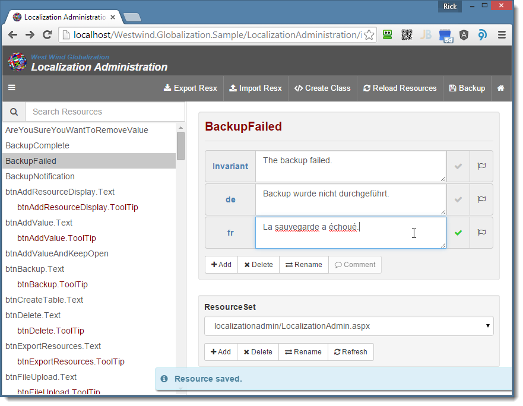
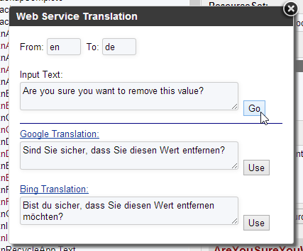

# West Wind Globalization
### Database Resource Localization for .NET

**Westwind.Globalization (.NET Standard, .NET 4.5+):**   
[](https://www.nuget.org/packages/Westwind.Globalization/)


**Westwind.Globalization.AspNetCore (.NET Core):**  
[](https://www.nuget.org/packages/Westwind.Globalization.AspNetCore/)


**Westwind.Globalization.Web (.NET 4.5+):**  
[](https://www.nuget.org/packages/Westwind.Globalization.Web/)


This library and tooling provides easy to use database resource managers and providers that allow you to use a database for storing localization resources. Unlike static Resx resources, database resources are dynamic, can be changed at runtime and are editable by multiple users at the same time. The custom resource managers, providers and ASP.NET Core StringLocalizers use the standard .NET resource infrastructure, so other than startup configuration there are no code changes when switching from using traditional Resx resources. 

It's also possible to import resources into a database, edit them dynamically, and then export them back out into Resx and optionally strongly typed classes so your deployed applications can run with Resx resources, while you can use dynamic Database resources during development.

A rich, Web based resource editor is also provided that makes it easy to create resource content and translate it interactively in a running application where you can see resource changes immediately applied without recompilation. You can import and export Resx resources, generate strongly typed classes and serve resources to JavaScript applications using the database resources. 


### Quick Links

* [Nuget Packages](#nuget)
* [Features](#features)
* [Installation and Configuration for .NET Core](#installation-netcore)
* [Installation and Configuration for .NET 4.5+](#installation-fullframework)
* [Using Resources in your Application](#resource-usage)
* [The Web Resource Editor](#web-resource-editor)

### Requirements:
* .NET Core 2.0 or .NET 4.5 or later
* SQL Server 2008-2016, SQL Server Express, SQL Compact 4, MySql, SqLite

### .NET Version Support
Version 3.0 adds support for the 2.0 versions of .NET Standard, .NET Core and ASP.NET Core. The following versions are provided:

* Westwind.Globalization <small>*(net45 and netstandard2.0)*</small>  
[](https://www.nuget.org/packages/Westwind.Globalization/)

* Westwind.Globalization.AspNetCore <small>*(netstandard2.0)*</small>  
[](https://www.nuget.org/packages/Westwind.Globalization.AspNetCore/)

* Westwind.Globalization.Web <small>*(net45)*</small>  
[](https://www.nuget.org/packages/Westwind.Globalization.Web/)

* Westwind.Globalization.Sample <small>*(net45)*</small>
* Westwind.Globalization.Sample.AspNetCore <small>*(netcore2.0)*</small>

<a name="nuget"></a>
### Installation
Installation is different depending on which version of .NET you are running under **.NET Core** and **Full Framework** use different project types and NuGet Packages for the Web support.

> #### Limited non-Windows Support for Admin Features
> The admin features of this package have not been fully ported to non-Windows platforms. Specifically, any of the RESX and Import Export features will not work on non-windows platforms currently. However runtime database access is fully functional.

For installation use NuGet.

#### To Install for .NET Core
Please read the installation instructions below to configure once you've installed the project. You will need to configure startup settings in order for the Db Providers to run.
 
```
PM> Install-Package Westwind.Globalization.AspNetCore
```
If you're not using a Web Project you can just use the base package:

```
PM> Install-Package Westwind.Globalization
```

> #### ASP.NET Core Administration Web UI: Separate Download
> Due to changes in NuGet support in .NET Core we can no longer package static HTML, CSS and JS as part of NuGet packages. As a result a **separate download is required** to add the Localization Admin UI. You can download it from:
> 
> * [Documentation for installing Localization Admin Files](https://github.com/RickStrahl/Westwind.Globalization/tree/master/DownloadableAssets)
> * [Localization Admin  Html Assets Download](https://github.com/RickStrahl/Westwind.Globalization/blob/master/DownloadableAssets/LocalizationAdministrationHtml_AspNetCore.zip?raw=true)
>
> Unzip the contents of the Zip file into your project folder root, which creates the `./wwwroot/LocalizationAdmin` Web folder and adds related resources to `./Properties`.

#### To Install on .NET Framework
Please read the Installation Section below or watch the [Getting Started Video](https://youtu.be/ABR7ISppB1k), which describes how to install the packages, configure the project, import existing re

```
PM> Install-Package Westwind.Globalization.Web.Starter
```
or if you don't want sample resources and a test page, simply use:
```
PM> Install-Package Westwind.Globalization.Web
```

If you're not using a Web Project or you're using MVC/Web API **and** don't need the Web Resource Editor you can just use the core package:
```
PM> Install-Package Westwind.Globalization
```

### Resources:
* [Westwind.Globalization Home Page](http://west-wind.com/westwind.globalization/)
* [Nuget Package](https://www.nuget.org/packages?q=westwind.globalization)
* [Video: Getting Started with West Wind Globalization 2.0](https://youtu.be/ABR7ISppB1k)
* [Wiki Documentation and FAQ](http://west-wind.com/westwind.globalization/docs/)
* [Original Article for Database Driven Resource Provider](http://www.west-wind.com/presentations/wwdbresourceprovider/)
* [Westwind-Globalization on StackOverFlow](http://stackoverflow.com/questions/tagged/westwind-globalization)
* [Class Reference](http://west-wind.com/westwind.globalization/docs/?page=_40y0vh66q.htm)
* [Change Log](ChangeLog.md)
* [License](#license)


<a name="Features"></a>
### Features
* .NET Resources in Sql Server, SqlCe, MySql and SqLite   
* Injectable .NET Core StringLocalizers (ASP.NET Core)
* ASP.NET Database ResourceProviders (ASP.NET/WebForms) 
* .NET  ResourceManager (ASP.NET MVC,non-Web apps)
* Uses standard .NET Resource infrastructure and caching
* Or: Use our dynamic DbRes string based helper (works anywhere)
* Interactive Web Resource Editor to edit Resources
* Keyboard optimized resources editing
* Translate text resources with Google or Bing
* Use Markdown in your text resources
* Import and export Resx resources 
* Generate strongly typed classes from the Db resources
* Release and reload resources in running Web apps
* Serve .NET Resources to JavaScript as JSON
* Create your own custom DbResourceManagers
* Directly access and manage DbResources with code 


Because this library uses the standard .NET resource infrastructure using the DbResourceProvider or DbResourceManager requires no code changes from ResX resources, other than provider configuration in your .config file and potentially a few lines of startup code.  You can import existing Resx resources and edit them interactively. Serve your resources either with the DbResourceProvider or DbResourceManager, or if you chose export them back out to Resx files for your final application code. Importing and exporting is a easily done from the Web admin interface or can be fired using code including as part of your build process.

> **Note**: The database is accessed only once per ResourceSet and per Locale, using the
> standard .NET Resource caching architecture used in Resource Providers and
> Resource Managers, so database access and usage is minimal. You can use these 
> Providers/Manager in MVC, WebForms and even in non Web applications.

<a name="web-resource-editor"></a>
### Web Resource Editor
One of the main reasons people want to use Database resources rather
than Resx resources is that it allows for dynamic updates of resources. Resx
resources are static and compiled into an application and so are typically
tied to the development process, while dynamic resources can be updated
separately even after the application has been completed and deployed.

Since data is stored in a database it's easy to create editing front ends
or programmatic tools that simply manipulate the database. This library
ships with a Web interface that allows editing of resources interactively
and an easy to use data API to update resources programmatically.




The resource editor is an easy way to localize resources interactively,
but it's not the only way you can do this of course. Since you have access 
to the data API underneath it as well as the database itself, it's 
easy to create your own customized UI or data driven API that suits your
application needs exactly.

> **Markdown Support** The resource edit form allows you to optionally use Markdown for resource editing which in addition to localization makes it possible to use this libary as a basic CMS to manage user manageable content in your applications.


### How the database Providers work
This library implements a custom .NET `ResourceManager` and 
ASP.NET `ResourceProvider` (for .NET 4.x) that are tied to a database provider interface (although you can implement non-data providers as well). This means you  can access resources using the same mechanisms that you use with standard Resx Resources in your .NET applications. It also means although resources are initially loaded from the database for the first load of each `ResourceSet`. .NET then caches resources for each individual `ResourceSet` and locale the same way that Resx resources are read from the assembly resources and then cached. 

> The database is hit only for the first read of a given 
ResourceSet/Locale combination - not every resource access
hits the database!

The `DbResourceManager` can be used in any type of .NET application using the `DbRes` or `DbResInstance` class methods, generated strongly typed classes, or using the Resource
Manager directly. The DbResourceProvider classes can be used in ASP.NET applications - especially for WebForms with support for local and global resources, implicit resources and control meta tags. MVC applications typically use the ResourceManager with strongly typed resources or the
`DbRes` classes or by exporting resources back into RESX. 

Underneath the .NET providers lies a the `Westwind.Globalization` data
access layer (IDbResourceDataManager) that provides the data interface 
to provide access to various providers. The default provider uses **SQL Server**
as a data source with additional providers available for **MySql**, **SqLite** and
**SqlCompact**. This API is accessed by the Resource Provider and Resource Manager
implementations to read the resources from the database.

Additionally the API can be directly accessed to provide resource access, and the DbRes helper class provides very easy access to these resources using the DbRes.T() method which can be thought of as a high level translation method.

This interface is also directly accessible and allows your code as well as support code like the UI Web Resource editor to easily access and manipulate resources in real-time at runtime.

This library includes quite a proliferation of classes most of it due to the implementation requirements for the .NET providers which require implementation of a host of interface based classes for customization. 

There are three distinct resource access mechanisms supported:

* ASP.NET Resource Provider (best used with WebForms)
* .NET Resource Manager and strongly typed resources 
  (Non-Web apps, ASP.NET Core, classic MVC apps or anywhere where you already use Resx)
* Direct Db Provider access using `DbRes` and `DbResInstance` helpers  
(easiest overall - works everywhere)

## Running the Sample Application
To run the sample application you have to set up a database to provide the resources. The following assumes you are using the default configuration which uses SQL Server and a database named *Localizations* - you can  change this via web.config settings (see the following section for more details). 
 
* Create a SQL Server/Express Database called `Localizations`
* Make sure the Web User using **has rights** to create a Table in this DB
* Open `http://localhost:xxxxx/LocalizationAdmin/index.html` in your browser
* You'll get an error message like: <br/>
  *ResourceLoadingFailed: Invalid Object Name Localizations*
* Use the `Create Table` button to create the *Localizations* table
* Use `Import or Export Resx` button to import resources from the project into the db
* Select `Import Resources`	from the dropdown
* Use the path of `~/Properties/` for Resx Import Folder
* Click on the Import Resources button
* You should now have all the sample and LocalizationForm resources in the db


## Installation and Configuration
The easiest way to use this library in your own applications is to install the NuGet package into an ASP.NET application.

<a name="installation-netcore"></a>
### ASP.NET Core Packages
```
pm> Install-Package Westwind.Globalization.AspNetCore
```

> #### @icon-info-circle Download the Localization Admin UI Files
> Nuget no longer allows distribution of static content, so in order to use the Localization Admin UI you also need to download the resources for the Localization Admin UI if you want to integrate the Localization interface into your application.
> 
> * [Localization Admin Html Assets](https://github.com/RickStrahl/Westwind.Globalization/blob/master/DownloadableAssets/LocalizationAdministrationHtml_AspNetCore.zip?raw=true)
> * [Documentation for installing Localization Admin Files](DownloadableAssets/Readme.md) 
>
> Once you've downloaded the Localization Admin UI zip file, unzip the entire content into the project's root folder.


For non-Web applications or if you use only the DbRes based localization features, you can just install the base package.

```
pm> Install-Package Westwind.Globalization
```
ASP.NET Core integration works in combination with ASP.NET Core new Localization features. Westwind.Globalization builds on top of this, or you can just use its native features. West Wind Globalization supports:

* `IStringLocalizer` DI via custom `IDbResourceStringLocalizer`
* `appSettings.json` configuration (optional)

### ASP.NET Core Configuration
Configuration can be accomplished in 3 ways:

1. Using a standalone `dbResourceConfiguration.json` file
2. Using `appsettings.json` in a `DbResourceProvider` object
3. Additional ASP.NET Core `IConfiguration` functionality configured
(ie. Environment variables, user secrets)
4. Explicit configuration via `AddWestwindGlobalization(opt => return true)`

Configuration values are applied in the order listed, with later assignments over-writing earlier settings.

#### DbResourceConfiguration
You can create a standalone `DbResourceConfiguration.json` file for configuration that works both in full framework and .NET Core:
```json
{
  "ResourceAccessMode": "DbResourceManager",
  "ConnectionString": "server=.;database=localizations;integrated security=true;",
  "DataProvider": "SqlServer",
  "ResourceTableName": "Localizations",
  "ResxExportProjectType": "Project",
  "ResxBaseFolder": "~/Properties/",
  "StronglyTypedGlobalResource": "~/Properties/Resources.cs",
  "ResourceBaseNamespace": "AppResources",
  "AddMissingResources": true,
  "LocalizationFormWebPath": "~/LocalizationAdmin/",
  "GoogleApiKey": "XXXfaSyDcvmGhGN7FlynP9QUZOLF8_4K8iF9ChWo",
  "BingClientId": "12345-4b99-47ed-be7e-caf733526020"
}
```
If this file exists configuration values are read from it.

> #### @icon-warning Copy to Output Directory
> If you want to use `DbResourceConfiguration.json` for configuration storage make sure you set the **Copy to Output Directory** option to **Copy if newer** or **Copy always** to ensure the file is copied into the published output folder.
>
> 

#### ASP.NET Core IConfiguration
For ASP.NET Core operation Westwind.Globalization also registers the `DbResourceConfiguration` instance as `IOptions<DbResourceConfiguration>` which gives strongly typed access to the configuration via depedency injection. 

This means you can use any configured configuration providers - most commonly:

* appsettings.json using a `DbResourceConfiguration` object
* Environment variables
* User Secrets store

You can store configuration settings in `appsettings.json` like this:

```json
{
  "Logging": {...},
  "DbResourceConfiguration": {
    "ResourceAccessMode": "DbResourceManager",
    "ConnectionString": "server=.;database=localizations;integrated security=true;",
    "DataProvider": "SqlServer",
    "ResourceTableName": "Localizations",
    "StronglyTypedGlobalResource": "~/Properties/Resources.cs",
    "ResourceBaseNamespace": "AppResources",
    "ResxExportProjectType": "Project",
    "ResxBaseFolder": "~/Properties/",
    "AddMissingResources": true,
    "LocalizationFormWebPath": "~/LocalizationAdmin/",
    "BingClientId": "12345-4b99-47ed-be7e-caf733526020",
    "GoogleApiKey": "XXXfaSyDcvmGhGN7FlynP9QUZOLF8_4K8iF9ChWo"
  }
}
```
If provided the `appsettings.json` file overrides `DbResourceConfiguration.json`. 

We recommend you only use one of the files to avoid confusion. For ASP.NET Core projects we recommend you store settings in `appsettings.json` since that gives you dependency injection for `IOptions<DbResourceConfiguration>` as well as putting configuration settings into a well-known location.

### Enabling West Wind Globalization in ASP.NET Core
You also need to explicitly enable localization features in ASP.NET Core using the following code in the `Startup.cs` file's `ConfigureServices()` method:

```cs
public void ConfigureServices(IServiceCollection services)
{
    // Standard ASP.NET Localization features are recommended
    // Make sure this is done FIRST!
    services.AddLocalization(options =>
    {
        // I prefer Properties over the default `Resources` folder
        // due to namespace issues if you have a Resources type as
        // most people do for shared resources.
        options.ResourcesPath = "Properties";
    });
    

    // Replace StringLocalizers with Db Resource Implementation
    services.AddSingleton(typeof(IStringLocalizerFactory), 
                          typeof(DbResStringLocalizerFactory));
    services.AddSingleton(typeof(IHtmlLocalizerFactory),
                          typeof(DbResHtmlLocalizerFactory));
                          
    
    // Required: Enable Westwind.Globalization (opt parm is optional)
    // shown here with optional manual configuration code
    services.AddWestwindGlobalization(opt =>
    {                
        // the default settings comme from DbResourceConfiguration.json if exists
        // you can override the settings here, the config you create is added
        // to the DI system (DbResourceConfiguration)

        // Resource Mode - from Database (or Resx for serving from Resources)
        opt.ResourceAccessMode = ResourceAccessMode.DbResourceManager;  // .Resx
        
        // Make sure the database you connect to exists
        opt.ConnectionString = "server=.;database=localizations;uid=localizations;pwd=local";
        
        // Database provider used - Sql Server is the default
        opt.DataProvider = DbResourceProviderTypes.SqlServer;

        // The table in which resources are stored
        opt.ResourceTableName = "localizations";
        
        opt.AddMissingResources = false;
        opt.ResxBaseFolder = "~/Properties/";

        // Set up security for Localization Administration form
        opt.ConfigureAuthorizeLocalizationAdministration(actionContext =>
        {
            // return true or false whether this request is authorized
            return true;   //actionContext.HttpContext.User.Identity.IsAuthenticated;
        });

    });

    ...
    
    services.AddMvc();
}
```

Any code changes made override any of the file values. You can also replace the entire `DbResourceConfiguration` object entirely in this handler.

In addition you probably will want to add standard ASP.NET Core Localization features to the `Configure()` method in `Startup.cs`:

```cs
public void Configure(IApplicationBuilder app) 
{
    ..
  
    var supportedCultures = new[]
    {
        new CultureInfo("en-US"),
        new CultureInfo("en"),
        new CultureInfo("de-DE"),
        new CultureInfo("de"),
        new CultureInfo("fr")
    };
    app.UseRequestLocalization(new RequestLocalizationOptions
    {
        DefaultRequestCulture = new RequestCulture("en-US"),
        SupportedCultures = supportedCultures,
        SupportedUICultures = supportedCultures                 
    });
}
```         
#### Dependency Injection for DbResourceConfiguration
You can get access to DbResourceConfiguration in a number of ways:

* Via DI by asking for `DbResourceConfiguration`
* Via DI by asking for `IOptions<DbResourceConfig>` (if loaded through IConfiguration)
* Static `DbResourceConfiguration.Current` 

#### Dependency Injection for IDbResStringLocalizer
One of the base features of ASP.NET Core's Localization is `IStringLocalizer` which provides the provides an interface to map type signatures to instances of Resx resources. `DbResStringLocalizer` uses the `DbResourceManager` (which supports switchable Db or Resx resource access).

To use the DbRes localizer, override the default `IStringLocalizer` with:

```cs
services.AddSingleton(typeof(IStringLocalizerFactory), typeof(DbResStringLocalizerFactory));
```  

> #### Use of IStringLocalizer is optional. 
> You can use `DbRes.T()` or strongly typed resources directly if you prefer. However, for `DataAnnotation` localization `IStringLocalizer` is required in ASP.NET Core (shrug), so generally you'll want to add `DbResStringLocalizer` in `ConfigureServices()`.

<a name="installation-fullframework"></a>
### Full Framework Configuration
```txt
pm> Install-Package Westwind.Globalization.Web
```

If you're not using a Web Project, or an MVC/Web API project that doesn't use the Web Resource Editor you can use the core package:

```txt
pm> Install-Package Westwind.Globalization
```
which doesn't install the web related components and HTML resources. 

The .Web version installs the required assemblies, adds a few configuration entries in web.config and enables the resource provider by default. The Starter package adds sample resources and a couple of test pages. I recommend you use the .Starter package so you can ensure the provider is working and serving resources - once up and running you can remove the starter package, leaving the dependent assemblies in place.


### Full Framework Configuration
ASP.NET Classic uses the web.config Configuration file for configuration

```xml
<configuration>
  <configSections>
    <section name="DbResourceConfiguration" requirePermission="false" 
			 type="System.Configuration.NameValueSectionHandler,System,Version=1.0.3300.0, Culture=neutral, PublicKeyToken=b77a5c561934e089" />
  </configSections>  

  <DbResourceConfiguration>
    <add key="ConnectionString" value="server=.;database=Localizations;integrated security=true;" />
    <add key="ResourceTableName" value="Localizations" />
    <add key="AddMissingResources" value="False" />

    <!-- Resource Imports and Exports -->
    <add key="ResxExportProjectType" value="Project" />
    <add key="StronglyTypedGlobalResource" value="~/Properties/Resources.cs" />
    <add key="ResourceBaseNamespace" value="WebApplication1.Properties" />    
    <add key="ResxBaseFolder" value="~/Properties" />

    <!-- WebForms specific only -->
    <add key="LocalizationFormWebPath" value="~/LocalizationAdmin/" />
    <add key="DesignTimeVirtualPath" value="" />
    <add key="ShowLocalizationControlOptions" value="False" />
    <add key="ShowControlIcons" value="False" />

    <!-- Google Translate API -->
    <add key="GoogleApiKey" value="" />

    <!-- Bing Translation -->
    <add key="BingClientId" value="" />
  </DbResourceConfiguration>

  <!-- Enable ASP.NET Resource Provider  -->
  <system.web>
    <globalization resourceProviderFactoryType=
     "Westwind.Globalization.DbSimpleResourceProviderFactory,Westwind.Globalization.Web" />
  </system.web>
</configuration>
```
#### Overriding Configuration Settings (Full Framework)
To override configuration settings that are set in `web.config` you can access the DbResourceConfiguration.Current instance that's used to configure the application. 

```cs
protected void Application_Start()
{                       
    FilterConfig.RegisterGlobalFilters(GlobalFilters.Filters);
    RouteConfig.RegisterRoutes(RouteTable.Routes);

    // Specify where config information comes from (config file is default - can be separate Json/Xml)
    //DbResourceConfiguration.ConfigurationMode = ConfigurationModes.ConfigFile;
    
    var config = DbResourceConfiguration.Current;
    
    config.ConnectionString = "SqlServerLocalizations";
    config.DbResourceDataManagerType = typeof(DbResourceSqlServerDataManager);

    //DbResourceConfiguration.Current.ConnectionString = "MySqlLocalizations";
    //DbResourceConfiguration.Current.DbResourceDataManagerType = typeof(DbResourceMySqlDataManager);

    // force ResourceMode explicitly. Default is AspNetResourceProvider
    GeneratedResourceSettings.ResourceAccessMode = ResourceAccessMode.DbResourceManager;
    //GeneratedResourceSettings.ResourceAccessMode = ResourceAccessMode.Resx;

    // *** Remove or Add custom resource converters
    // *** By default the MarkdownResourceConverter is provided
    //DbResourceConfiguration.Current.ResourceSetValueConverters.Clear();
    //DbResourceConfiguration.Current.ResourceSetValueConverters.Add(new MarkdownResourceSetValueConverter());
}
```

Settings made here occur before any requests are made to the providers, so `Application_Start` is a good way to initialize settings, including selecting a provider. Any of the Configuration values can be set here, or anywhere else by using the static `DbResourceConfiguration.Current` instance.

#### Setting ASP.NET Locale based on Browser Locale (Full Framework)
In order to do automatic localization based on a browser's language used you can sniff the browser's default language and set the UiCulture in the Begin_Request handler of your ASP.NET application class. A helper method to provide this functionality automatically is provided.

```C#
protected void Application_BeginRequest()
{
    // Automatically set the user's locale to what the browser returns
    // and optionally only allow certain locales/locale-prefixes
    WebUtils.SetUserLocale(allowLocales: "en,de");
}
```

This forces the user's Culture and UI Culture to whatever the browser is using,
and explicitly. Now when a page is rendered it will use the UiCulture of the browser.
The optional allowLocales enforces that only certain locales can be set - anything
not matched is defaulted to the server's default locale.

The way .NET resource managers work, if there's no match for the locale the user
provides, resources fall back to the closest matching locale or the invariant locale.
So if the user comes in with it-IT but you don't support it or it-IT in your resources
the user will see resources for invariant. Likewise if a user comes in with 
de-CH (Swiss german) and you de (without a locale specific suffix) the de German
version will be returned. Resource Fallback tries to ensure that always something
is returned.

### Configuration Settings (.NET Core and Full Framework)

**ConnectionString and ResourceTableName**   
The two most important keys are the connectionString and resourceTableName which point at your database and a table that holds resources. On full framework you can use either a raw connection string or a Connection String Name defined in `<ConnectionStrings>` of your `web.config` file.

**AddMissingResources**  
When set to true causes any resource lookup that fails to produce matching resource ID to write the invariant resource into the database. Use with caution - as this might slow down your application significantly as you now write to the database on any missing resources. Use only during development and testing to get resources into the system for easier debugging later.

**ResxExportProjectType**  
This option determines how the Resx export feature works. The two options are `Project` or `WebForms`. Project exports all resource files into \Properties folder underneath the resxBasePath and excludes any resource sets that include a . in their name (assumed to be ASP.NET resources). WebForms writes out resources into folder specific App_LocalResources and App_GlobalResources folders based on the root folder

**ResxBaseFolder**  
The base folder that's used for all Resx Import and Export operations. The default is ~/ which is the root web folder, but you can specify a full OS path here. Note that this allows you to read/write resources in other non-web projects - as long as your Web application has writes to the folder specified.

**StronglyTypeGlobalResource and ResourceBaseNamespace**
If you do a strongly typed class export from the admin manager all resources will be created in a single file in the this file using the ResourceBaseNameSpace as the namespace in the generated class.

#### Run the Web Resource Editor
In order to use database resources you'll actually have to create some resources in a database. Make sure you've first added a valid connection string in the config file in the last step! Then open the `/LocalizationAdmin/index.html` in your browser and click on the *Create Table* button in the toolbar.

Once the table's been created you can now start creating resources interactively, by directly
adding values to the database table, or by using the DbResourceDataManager API to manipulate the
data programmatically.

By default a `Resources` ResourceSet has been provided for you the resources of which are used in the test page. You can remove those resources or the resource set as needed once you know the provider works. ResourceSets are logical groups of resources that belong together - I like to use one ResourceSet per form or per application feature depending on how much content is involved. But you can also use a single ResourceSet for your entire application if you want. Whatever works for you to make it easy to find resources.

#### Import Existing Resources
I also recommend that you first perform an *Import Resx* step to pull any existing Resx resources from the `~/Properties/` folder (or whereever) into your project. This will also import the Localization form's resources into your database so that the localization form properly localizes when running with the DbResource Provider.

<a name="resource-usage"></a>
## Using Resources in your Application
There are a number of different ways to access resources from this provider.

* Direct access with DbRes 
* ASP.NET Resource provider
* .NET Resource Manager
* Strongly Typed Resources

### DbRes Helper Class
The `DbRes` and `DbResInstance` Helper class are wrappers around the `DbResourceManager` and `DbResouceDataManager` object. The DbRes class contains a handful of common use methods that are used to retrieve and manipulate resources by name and resource set.

In an ASP.NET Web MVC (or WebPages) application you can use:

```C#
// Using current UiCulture - empty resource set uses default (Resources)
DbRes.T("HelloWorld")

// Exact match with resource - Hallo Welt
DbRes.T("HelloWorld","Resources","de")

// Resource Fallback to de if de-CH doesn't exist - Hallo Welt
DbRes.T("HelloWorld","Resources","de-CH")
```

This is an easy mechanism that's tied closely to the database
resources created and can be applied with minimal fuss in any
kind of .NET application.

### ASP.NET MVC or ASP.NET WebPages
```HTML
Say Hello: @DbRes.T("HelloWorld") at @DateTime.Now
```

### ASP.NET WebForms
```HTML
Say Hello: <%: DbRes.T("HelloWorld") %> at <%= DateTime.Now %>
```

### In .NET code
```HTML
string value = DbRes.T("HelloWorld");
```

The `DbRes.T()` method returns the ResourceId passed in if a resource is missing in the ResourceSet which can be useful for providing 'default' text. Some people like to use full resource strings as their resource Ids so default values are always available even if a resource is missing or the provider is not available. 

## Using the ASP.NET Resource Provider  (Full Framework, WebForms)
If you're using an existing WebForms application or you want to
use the ASP.NET based Resource Provider model for accessing resources
you can use the DbSimpleResourceProvider. This implementation is an
ASP.NET Resource Provider implementation that directly accesses the
DbResourceDataManager to retrieve resources. A second Resource Provider
implementation that uses the DbResourceProvider uses the DbResourceManager
to indirectly access resources. Typically the DbSimpleResourceProvider is
the more efficient interface.

To use this provider you have to enable it in web.config. To do so:

```XML
<configuration>  
  <system.web>
       <globalization resourceProviderFactoryType="Westwind.Globalization.DbSimpleResourceProviderFactory,Westwind.Globalization.Web" />    
       <!--<globalization resourceProviderFactoryType="Westwind.Globalization.DbResourceProviderFactory,Westwind.Globalization" />-->    
  </system.web>
</configuration>
```

Once enabled you can use all the standard ASP.NET Resource Provider
features:

* GetGlobalResourceObject, GetLocalResourceObject on Page and HttpContext
* Using meta:resourcekey attributes on Web Controls

### Page.GetGlobalResourceObject() or HttpContext.GetGlobalResourceObject() 
```HTML
<legend>ASP.NET ResourceProvider</legend>
<label>Get GlobalResource Object (default locale):</label>
<%: Page.GetGlobalResourceObject("Resources","HelloWorld") %>
```

### Page.GetLocalResourceObject()
```HTML
<label>GetLocalResourceObject via Expression:</label>                 
<%: GetLocalResourceObject("lblHelloWorldLabel.Text") %>
```

### WebForms Control meta:resourcekey attribute
```HTML
<label>Meta Tag (key lblHelloWorldLabel.Text):</label>
<asp:Label ID="lblHelloLabel" runat="server" meta:resourcekey="lblHelloWorldLabel"></asp:Label>
```

### WebForms Resource Expressions
```HTML
<label>Resource Expressions (Global Resources):</label>
<asp:Label ID="Label1" runat="server" Text="<%$ Resources:Resources,HelloWorld %>"></asp:Label>
```


## Strongly typed Resources
The Web Resource Editor form allows you to create strongly typed resources
for any global resources in your application. Basically it'll go through all the 
non-local resources in your file and create strongly type .NET classes in a file that
is specified in the DbResourceProvider configuration settings.

```
<add key="StronglyTypedGlobalResource" value="~/Properties/Resources.cs" />
<add key="ResourceBaseNamespace" value="WebApplication1.Properties" />
```
You specify the namespace and filename to generate it to. Once you've generated the strongly typed resource file with the embedded resource class(es), you need to recompile your application to make the resource properties available to it.
 
The generated resources can use either the ASP.NET resource provider (which uses
whatever provider is configured - Resx or DbResourceProvider) or the 
DbResourceManager which only uses the DbResourceManager. Using the latter allows
you to also generate resources for use in non-Web applications.

Here's what generated resources look like:
```C#
namespace WebApplication1.Properties
{
    public class GeneratedResourceSettings
    {
        // You can change the ResourceAccess Mode globally in Application_Start  
        // AspNetResourceProvider, Project (MVC, Windows), Resx      
        public static ResourceAccessMode ResourceAccessMode = ResourceAccessMode.AspNetResourceProvider;
    }

	public class Commonwords
	{
		public static System.String Ready
		{
			get
			{
				if (GeneratedResourceSettings.ResourceAccessMode == ResourceAccessMode.AspNetResourceProvider)
					return (System.String) HttpContext.GetGlobalResourceObject("Commonwords","Ready");
				return DbRes.T("Ready","Commonwords");
			}
		}

		public static System.String ThisIsALongLineOfText
		{
			get
			{
				if (GeneratedResourceSettings.ResourceAccessMode == ResourceAccessMode.AspNetResourceProvider)
					return (System.String) HttpContext.GetGlobalResourceObject("Commonwords","This is a long line of text");
				return DbRes.T("This is a long line of text","Commonwords");
			}
		}
	}
}
```

These can then be used in any ASP.NET application:

##### ASP.NET MVC or WebPages
```HTML
<div class="statusbar">@CommonWords.Ready</div>
```

##### ASP.NET WebForms
```HTML
<div class="statusbar"><%: WebApplication1.CommonWords.Ready %></div>
```
#### .NET Code
```C#
string ready = CommonWords.Ready;
```

Note that strongly typed resources must be re-generated whenever you add new
resources, so this is an ongoing process. As with the Resx Generator if
you remove or rename a resource you may break your code. 

Strongly typed resources are generated into a single file for all the resource sets exported in order to not clutter up your application with unnecessary generated files.  

## ASP.NET MVC ModelValidation (Full Framework)
ASP.NET and Entity Framework support model validation and you can also use the database provider to localize these validation messages. To do so **you have to generate strongly typed resources**, or export to Resx and then enable strong resource typing. ASP.NET/EntityFramework Model validation works based on class property access so in order to use it a type has to exist.

To do this:

* Open the Localization Administration form 
* Use *Export Class* to export create a class
* Or: Use *Export to Resx* to export Resx files (in Project mode)<br/>
then make sure to enable the strong type generation on the Resx and choose *Public class*

Once you've done this you can create your validation classes like you always would:

```c#
public class ViewModelWithLocalizedAttributes
{
    [Required(ErrorMessageResourceName = "NameIsRequired", ErrorMessageResourceType = typeof(Resources))]
    public string Name { get; set;  }

    [Required(ErrorMessageResourceName = "AddressIsRequired", ErrorMessageResourceType = typeof(Resources))]
    public string Address { get; set;  }
}
```

The type will be your exported class or generated Resx class and the name is the name of the property on the generated object. DataAnnotations use Reflection to lookup the property name, so if for some reason the validation does not work check the following:

* Make sure the property name is typed correctly and matches a property name.
* Try writing out the actual property using @Resources.AddressIsRequired to ensure the value is valid (on a simple test page perferrably). 


## Model Validation ASP.NET Core Mvc
ASP.NET MVC uses a completely different model for Model validation based on `IStringLocalizer`. In this initial .NET Core release we don't have support for this yet, but we're working on it. It's coming in an update soon.


## Switching Database Providers
By default the resource providers and manager use **SQL Server** to hold the database resources. If you don't do any custom configuration in code to specify the `DbResourceConfiguration.DbResourceDataManagerType` you'll get the Sql Server provider/manager. 

The following providers are supported:

* Sql Server (2008-2016, Sql Azure)
* MySql
* SqLite
* Sql Server Compact (no .NET Core support)

To use a specific provider, assign the `DbResourceConfiguration.DbResourceDataManagerType` to the appropriate engine you want to use during startup configuration.

* typeof(DbResourceSqlServerDataManager)
* typeof(DbResourceMySqlDataManager)
* typeof(DbResourceSqLiteDataManager)
* typeof(DbResourceSqlCompactDataManager)

In .NET Core you set the value in the `AddDbResourceLocalization(opt)` configuration:

```cs
services.AddWestwindGlobalization(opt =>
    ...
    opt.DbResourceDataManagerType = typeof(DbResourceMySqlDataManager);
    opt.ConnectionString = "server=localhost;uid=testuser;pwd=super10seekrit;" + 
                           "database=Localizations;charset=utf8"
```

For full framework you can set the value in the `Application_Start` handler and set the singleton configuration value:

```cs
DbResourceConfiguration.Current.DbResourceDataManagerType =
                  typeof(DbResourceSqLiteDataManager);
DbResourceConfiguration.Current.ConnectionString = 
    "server=localhost;database=Localizations;" +
    "uid=testuser;pwd=super10seekrit;charset=utf8" 
```                  

Note that the connection string can be set in configuration files (`app/web.config` in full framework, `DbResourceConfiguration.json` or `appsettings.json` in .NET Core), but the provider configuration has to be set in code.

Here's a little more info on how to specify each provider and the dependencies that are required.

### Sql Server
*no additional package needed*

.NET Core:
```
opt.ConnectionString = "server=.;database=localizations;integrated security=true";
// not required since it's the default
opt.DbResourceManagerType = typeof(DbResourceSqlServerManager);
```

web.config file connection String Example:

```xml
<add name="SqlServerLocalizations"
    connectionString="server=.;database=localizations;integrated security=true;"
    providerName="System.Data.SqlClient" />
```

### MySql

*add NuGet Package: **MySql.Data***

Code Configuration:
```c#
opt.ConnectionString = "server=localhost;uid=testuser;pwd=super10seekrit;database=Localizations;charset=utf8";
opt.DbResourceDataManagerType = typeof(DbResourceMySqlDataManager);                
```

web.config file connection String Example:

```xml
<add name="MySqlLocalizations"
    connectionString="server=localhost;uid=testuser;pwd=super10seekrit;database=Localizations;charset=utf8" 
    providerName="MySql.Data.MySqlClient" />
```

### SqLite
*.NET Core add Nuget Package:* **Microsoft.Data.SqLite**

*Full Framework add NuGet Package:* **System.Data.SQLite**

Code Configuration:
```c#
opt.ConnectionString = "Data Source=./data/SqLiteLocalizations.db";
opt.DbResourceDataManagerType = typeof(DbResourceSqLiteDataManager);
```  

> Make sure to use a valid path where the database file can be found and used.

web.config file connection String Example:
```xml
<add name="SqLiteLocalizations"
    connectionString="Data Source=|DataDirectory|\SqLiteLocalizations.db"
    providerName="System.Data.SQLite" />
```

### Sql Server Compact
*add NuGet Package: **Microsoft.SqlServer.Compact***

**not supported on .NET Core**

```c#
DbResourceConfiguration.Current.DbResourceDataManagerType = typeof(DbResourceSqlServerCeDataManager);
```
web.config connection string example:

```xml
<add name="SqlServerCeLocalizations" 
     connectionString="Data Source=|DataDirectory|\Localizations.sdf;Persist Security Info=False;" 
     providerName="System.Data.SqlServerCe.4.0" />
```

### Global Data Manager Configuration
This code configures the data manager globally so every time a data access operation occurs it instantiates the data manager configured here. It's important that you add the appropriate assembly first, otherwise these provider types will not be available and your code won't compile.


## JavaScript Resource Handler
If you're building applications that include JavaScript logic it's likely that you also need to access localized resources on the client. This library provides a JavaScript Resource Handler that can serve resources in the proper localized locale to your client application.

The resource handler allows you to specify which resources to serve and which locale - or auto-detected locale - to serve the data to your JavaScript client application.

The handler produces a JavaScript object map that is exposed as a global variable with properties for each of the resource keys:

```javascript
resources = {
	"HelloWorld": "Hallo schn\u00F6de Welt",
	"Ready": "Los",
	"Today": "Heute",
	"Yesterday": "Gestern",
    "dbRes": function dbRes(resId) { return resources[resId] || resId; }    
};
```

Resource values are normalized, meaning if a localized doesn't exist, resource fallback is used to fill the value. A `dbRes()` function is added to the object to allow returning the resource ID if a value can't be matched or if the resources for some reason fail to load.

Resources can be accessed in client code:

```html
<script>
    var hello = resources.HelloWorld;
    var hello2 = resources.dbRes("HelloWorld");
</script>
```

The latter will always return **some** value (HelloWorld) even if there's no matching property value to return.

### Configuration and Usage (ASP.NET Core)
For ASP.NET Core the JavaScript resource handling does not have to be configured - it's always available as long as ASP.NET MVC is active and running on the Web site. The handler is hooked in via custom routing that lives at a fixed URL.

To add client side script to the `api/JavaScriptLocalizationResources` endpoint (all in one line):

```html
<script src="/api/JavaScriptLocalizationResources?  
                ResourceSet=LocalizationForm&
                VarName=resources&
                localeId=auto&
                ResourceMode=ResDb"></script>
```

The following parameters are passed:

* **resourceSet** - The ResourceSet name to serve resources to serve.
* **varName** - The name of the global variable to declare the map on. This can also be a property value of an existing object like `page.resources` to avoid cluttering up global scope.
* **localeId** - Optional locale id like `de-DE` or `de`. If not passed the value is `auto` which reads the value from the users `accept-language` header.
* **resourceMode** - Either `ResDb` or `Resx` which determines whether resources are served from the database or resx. If not passed or `auto` the DbResourceConfig setting is used.


#### Configuration (.NET Framework)
To configure the Resource Handler for classic ASP.NET it has to be registered in web.config as follows:

```xml
<configuration>
<system.webServer>
<handlers>
    <add name="JavaScriptResourceHandler"
        verb="GET"
        path="JavascriptResourceHandler.axd"
        type="Westwind.Globalization.JavaScriptResourceHandler,Westwind.Globalization.Web" />
</handlers>
</system.webServer>
</configuration>
```

Note this entry is automatically made for you when you install the NuGet package.

#### Usage
The resource handler is then accessed as a script resource in your code by calling the
static JavaScriptResourceHandler.GetJavaScriptResourcesUrl() method:

```html
<script src="@JavaScriptResourceHandler.GetJavaScriptResourcesUrl("resources","Resources")"></script>
<script>
    document.querySelector("#JavaScriptHelloWorld").innerText = resources.HelloWorld;
    document.querySelector("#JavaScriptYesterday").innerText = resources.dbRes("Yesterday");
</script>
```


or if you're using a plain HTML page (all one line):

```html
<script src="JavaScriptResourceHandler.axd?ResourceSet=Resources&
                            LocaleId=auto&
                            VarName=resources&
                            ResourceType=resdb"></script>
<script>
    document.querySelector("#JavaScriptHelloWorld").innerText = resources.HelloWorld;
</script>
```

Either of the above generate the following script code (shown here localized in German):

```javascript
resources = {
	"HelloWorld": "Hallo schn\u00F6de Welt",
	"Ready": "Los",
	"Today": "Heute",
	"Yesterday": "Gestern",
    "dbRes": function dbRes(resId) { return resources[resId] || resId; }    
};
```

### Handler Url Formatting
A full JavaScript resource handler URL looks like this:

```
JavaScriptResourceHandler.axd?ResourceSet=Resources&LocaleId=auto&VarName=resources&ResourceType=resdb&ResourceMode=1
```

The QueryString parameters on the URL are used as follows:

##### ResourceSet
The ResourceSet name as defined in the database or the name of the ResX file relative to the ResxBaseFolder defined in the configuration.

##### LocaleId
This can be either a specific localeId like `de`, or `de-de`. Or it can be `auto` in which ASP.NET will use its default locale, which you can override to match the browser's locale as described in [Auto-detecting browser locale](Auto-Detecting-and-Setting-ASP.NET-Locale-based-on-Browser-Locale). The recommendation is to use `auto` and have IIS detect the browser locale and switch the thread UiCulture.

##### ResourceType - resdb,resx
You can specify what type of resources are loaded with this Resource handler. The options are `resdb`, which uses the dbResourceProvider/Manager or `resx` which uses Resx resources. Again in order for Resx resources to work the ResxBaseFolder must be set.

##### ResourceMode  0 (WebForms), 1 (Project/folder)
Determines how Resx Resources are loaded using either *project* (1) or *WebForms* (0) style resources. If *project* (0) resources are used make sure the ResxBaseFolder points to the path where your Resx resources like. If you use *WebForms* mode, resources are located using App_GlobalResources and App_LocalResources folders.


## Project Sponsors
The following people/organizations have provided sponsorship to this project by way of direct donations or for paid development as part of a development project using these tools:

* **Frank Lutz - Monosynth**<br/>
Frank provided a sizable donation to the project and valuable feedback for a host of improvements and bug fixes.

* **Craig Tucker - Alabama Software**<br/>
Craig offered early support and feedback for this project and billed project time for a number of additions to the library as part of a larger project.

* **Dan Martin - WeatherMaker**<br/>
Dan and his company provided a block of my billable hours dedicated to this project for adding support for MySql.

Want to sponsor this project, need customization or make a donation? You can contact me directly at rstrahl@west-wind.com or you can also make a donation online via PayPal.

* [Make a donation for Westwind.Globalization using PayPal](https://www.paypal.com/cgi-bin/webscr?cmd=_s-xclick&hosted_button_id=ERVCP2CMPS4QL)

## License
The Westwind.Globalization library is licensed under the
[MIT License](http://opensource.org/licenses/MIT) and there's no charge to use, 
integrate or modify the code for this project. You are free to use it in personal, 
commercial, government and any other type of application. 

[Commercial Licenses](http://west-wind.com/Westwind.Globalization/docs/?page=_2lp0u0i9b.htm) are 
also available as an option. If you are using these tools in a commercial application
please consider purchasing one of our reasonably priced commercial licenses that help support this project's development.

All source code is copyright West Wind Technologies, regardless of changes made to them. Any source code modifications must leave the original copyright code headers intact.


#### Warranty Disclaimer: No Warranty!
IN NO EVENT SHALL THE AUTHOR, OR ANY OTHER PARTY WHO MAY MODIFY AND/OR REDISTRIBUTE 
THIS PROGRAM AND DOCUMENTATION, BE LIABLE FOR ANY COMMERCIAL, SPECIAL, INCIDENTAL, 
OR CONSEQUENTIAL DAMAGES ARISING OUT OF THE USE OR INABILITY TO USE THE PROGRAM 
INCLUDING, BUT NOT LIMITED TO, LOSS OF DATA OR DATA BEING RENDERED INACCURATE OR 
LOSSES SUSTAINED BY YOU OR LOSSES SUSTAINED BY THIRD PARTIES OR A FAILURE OF THE 
PROGRAM TO OPERATE WITH ANY OTHER PROGRAMS, EVEN IF YOU OR OTHER PARTIES HAVE 
BEEN ADVISED OF THE POSSIBILITY OF SUCH DAMAGES.